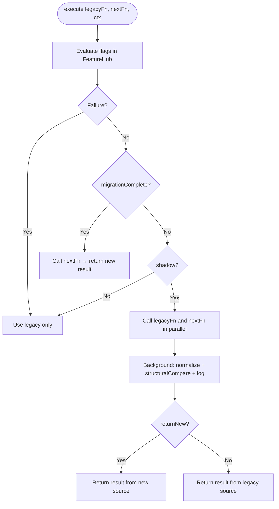
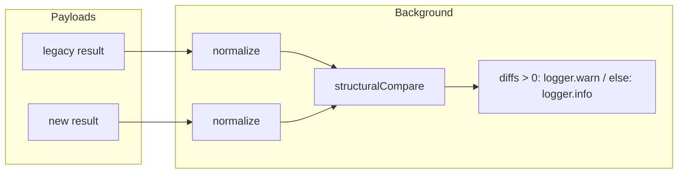

# Shadow migration

This folder contains the **shadow compare** logic: run two data sources in parallel (e.g. legacy API vs new API) and compare the results structurally to validate migrations without changing production behavior.

## Flow

The consumer calls `ShadowMigration.execute(legacyFn, nextFn, ctx)`, where:

- **`legacyFn`** and **`nextFn`** are functions that return `Promise<T>` (e.g. calls to the legacy and new APIs). `execute` invokes them according to the feature flags.
- **`ctx`** is the request context (with `ctx.vtex.account` and `ctx.vtex.logger` for logging).

**Feature flags** (FeatureHub) control the behavior. If evaluating the flags fails (e.g. FeatureHub unavailable), the fallback is to use **only the legacy source**.

| Flag | Effect |
|------|--------|
| `migrationComplete` | If `true`, only the new source is used and its result is returned. |
| `shadow` | If `true`, both sources are called in parallel; the returned result depends on `returnNew`. |
| `returnNew` | In shadow mode, controls whether the response to the client comes from the new source (`true`) or legacy (`false`). |

In **shadow** mode, the comparison runs in the background: both payloads are normalized and go through a structural diff. **Logging**:
- **No diffs**: `logger.info` with a message indicating no structural differences.
- **Diffs found**: `logger.warn` with the diff count, summary, and the first differences.

### Diagram: flag-based decision

### Diagram: comparison pipeline (shadow mode)

## Main files

| File | Responsibility |
|------|----------------|
| **ShadowMigration.ts** | Orchestrates execution (legacy/next), evaluates flags, and schedules the comparison. |
| **structuralCompare.ts** | Structural diff between two values: keys, types, array lengths, presence (does not compare literal values). |
| **normalizers/** | Functions that project each source’s payload to a comparable shape (e.g. aligned to `SearchProduct[]`). |

## Product normalizer

The product normalizer **does not** run resolvers. A single function ensures both payloads (legacy and new) are projected to the **same shape** aligned to the `SearchProduct[]` type: same set of keys (with defaults for missing ones), so the structural diff reflects only relevant differences. `structuralCompare` reports the difference types documented below (missing_key, extra_key, array_length_mismatch, type_mismatch, presence_mismatch).

## Adding another shadow migration

1. Create a **normalizer** in `normalizers/` that takes the payload and returns a comparable shape. The function must be **synchronous** (`(data: T) => unknown`), e.g. projecting to a common type (like `SearchProduct[]` for product).
2. Instantiate `ShadowMigration` with:
   - **`normalize`**: your normalization function (synchronous)
   - **`name`**: migration identifier (used in logs)
   - **`flags`**: object with the FeatureHub flag names: `{ migrationComplete, shadow, returnNew }`
3. In the service, call `migration.execute(legacyFn, newFn, ctx)`. The return type is `ExecuteResult<T>`:
   - **`result`**: the payload returned to the client
   - **`source`**: `'legacy'` or `'new'`, indicating which source was used

## Difference types (structuralCompare)

The diff is **structural**: it compares keys, types, lengths, and presence (empty vs non-empty), **not** literal values.

| Type | Description |
|------|-------------|
| `missing_key` | Key present only in the legacy payload |
| `extra_key` | Key present only in the new payload |
| `array_length_mismatch` | Arrays with different lengths at the same path |
| `type_mismatch` | Different types at the same path (e.g. string vs number) |
| `presence_mismatch` | One value “empty” and the other not (e.g. `''` vs `'x'`, `null` vs object) |

When there are diffs, the warning log includes the first differences and a **summary** by category (`legacy_has_more`, `new_has_more`, `both_different`). When there are no diffs, an **info** log is emitted to indicate a successful structural match.

**Limits**: The comparison caps tree depth and the number of elements compared in each array (see constants in `structuralCompare.ts`) to avoid excessive cost.
