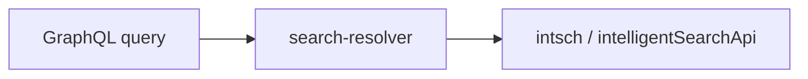

# hideUnavailableItems passthrough (remove DP defaulting)

> **Status**: Done
> **Created**: 2026-09-03
> **Related PR**: [#533](https://github.com/vtex-apps/search-resolver/pull/533) (original DP defaulting)

## 1. Business Context

### Problem Statement

PR [#533](https://github.com/vtex-apps/search-resolver/pull/533) added resolver-side defaulting for `hideUnavailableItems`: when the GraphQL caller omitted the field, search-resolver set it to `true` if the segment had `deliveryZonesHash` (Delivery Promise) and `false` otherwise.

That workaround existed because Intelligent Search mixed unavailable products into sorted results when `hideUnavailableItems` was false. The sort issue is fixed upstream. Keeping a DP-specific path in the resolver no longer solves anything and overrides storefront intent.

### Goals

- Pass `hideUnavailableItems` through from the GraphQL query for every session, including DP.
- Remove the dedicated helper and segment lookup added only for that defaulting.
- Leave explicit values (`true`, `false`, `null`, omitted/`undefined`) unchanged.

### User Stories

#### US-1: Storefront owns availability filtering

- **Story**: As a storefront developer, I want `hideUnavailableItems` forwarded as I sent it, so that PLP, facets, and sponsored products match the GraphQL query.
- **Acceptance Criteria**:
  - **Given** `hideUnavailableItems` is omitted, **when** `productSearch`, `facets`, or `sponsoredProducts` runs, **then** the resolver does not inject a default.
  - **Given** `hideUnavailableItems` is `true`, `false`, or `null`, **when** those queries run, **then** the same value is forwarded downstream.

### Key Scenarios

| Scenario | Pre-conditions | Steps | Expected Result |
|---|---|---|---|
| Field omitted | Any segment (DP or not) | Run `productSearch` / `facets` / `sponsoredProducts` | Downstream args omit the field (`undefined`) |
| Explicit false | Query sets `hideUnavailableItems: false` | Run product search | Downstream receives `false` |
| Explicit true | Query sets `hideUnavailableItems: true` | Run product search | Downstream receives `true` |
| Explicit null | Query sets `hideUnavailableItems: null` | Run product search | Downstream receives `null` |

### Functional Requirements

- Product search, facets, and sponsored products must not rewrite `hideUnavailableItems` based on `deliveryZonesHash`.
- No replacement helper for omitted values.

### Non-Functional Requirements

- No schema changes in `vtex.search-graphql`.
- No new app settings or flags.

### Out of Scope

- Legacy `search` client default (`hideUnavailableItems = false` in `node/clients/search.ts`).
- IS platform sort behavior.

---

## 2. Arch Decisions

### Proposed Solution

Delete `node/utils/hideUnavailableItems.ts` and stop calling it. Pass the request args built from GraphQL input straight to the IS clients.

### Architecture Overview



| Module | Change |
|---|---|
| `node/utils/hideUnavailableItems.ts` | Delete |
| `node/services/productSearch.ts` | Pass `intschArgs` as built |
| `node/services/facets.ts` | Pass `intschArgs` as built |
| `node/resolvers/search/index.ts` `sponsoredProducts` | Pass `biggyArgs`; drop segment fetch added only for this default |

### Alternatives Considered

| Alternative | Pros | Cons | Verdict |
|---|---|---|---|
| Keep helper, skip default only on DP | Smaller first diff | Two paths for the same field; helper naming no longer matches | Rejected after review |
| Always default omitted to `false` | Matches post-#533 non-DP behavior | Still a resolver override; not pre-#533 | Rejected |
| **Delete helper, pass through** | One path; matches pre-#533 | Callers that omitted the field on non-DP no longer get resolver `false` | **Accepted** |

### Risks & Mitigations

| Risk | Impact | Likelihood | Mitigation |
|---|---|---|---|
| Storefronts relied on implicit `true` on DP | Med | Low | Sort is fixed; they can still send `true` |
| Storefronts relied on implicit `false` when omitted | Low | Low | Schema/client may still omit or serialize `undefined`; same as pre-#533 |

### Key Decisions

#### Decision 1: No DP-specific defaulting

- **Status**: Accepted
- **Context**: Reviewer noted the helper only skipped the default for DP, which has no remaining justification.
- **Decision**: Remove defaulting for all sessions.
- **Consequences**: One forwarding path; helper and its tests go away.

### Implementation Plan

1. Remove helper, tests, and call sites.
2. Restore `sponsoredProducts` to pass `biggyArgs` without a segment round-trip.
3. Update CHANGELOG.

---

## 3. Technical Contract

### Data Models

`hideUnavailableItems?: boolean | null` on product search, facets, and sponsored product args. Unchanged.

### Interfaces

No public helper. Downstream clients already forward:

```ts
hideUnavailableItems: params.hideUnavailableItems ?? undefined
```

### Integration Points

| Downstream | Behavior |
|---|---|
| `intsch.productSearch` | Forwards GraphQL value |
| `intsch.facets` | Forwards GraphQL value |
| `intelligentSearchApi.sponsoredProducts` | Forwards GraphQL value |

### Invariants & Constraints

- Resolver must not force `hideUnavailableItems` from segment state.
- `@withSegment` / cache headers unchanged.
- No `vtex.search-graphql` release required.

### Verification

```sh
cd node && yarn test productSearch.test facets.test resolvers/search/index.test
make lint
```
