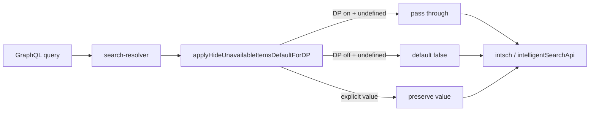

# hideUnavailableItems passthrough for Delivery Promise requests

> **Status**: Done
> **Created**: 2026-09-03
> **Related PR**: [#533](https://github.com/vtex-apps/search-resolver/pull/533) (original DP defaulting), revert of DP `true` override

## 1. Business Context

### Problem Statement

PR [#533](https://github.com/vtex-apps/search-resolver/pull/533) introduced resolver-side defaulting for `hideUnavailableItems`: when the shopper segment includes `deliveryZonesHash` (Delivery Promise / DP enabled) and the GraphQL caller omits the field, `vtex.search-resolver` forced `hideUnavailableItems: true` before calling Intelligent Search.

That workaround addressed an unavailable-item sorting bug in the IS platform. The sort issue is now fixed upstream, so forcing `true` is no longer needed and prevents storefronts from controlling availability filtering on DP-enabled sessions when they intentionally omit or rely on upstream defaults.

### Goals

- Stop overriding `hideUnavailableItems` to `true` for DP-enabled requests.
- Preserve upstream control: pass the value as received from the GraphQL query when DP is on.
- Keep existing non-DP behavior: when DP is off and the field is omitted, default to `false`.
- Preserve explicit values (`true`, `false`, `null`) in all cases.

### User Stories

#### US-1: Storefront controls availability filtering on DP sessions

- **Story**: As a storefront developer, I want `hideUnavailableItems` forwarded unchanged on delivery-promise sessions, so that my PLP/facets behavior matches what I send in the GraphQL query.
- **Acceptance Criteria**:
  - **Given** a segment with `deliveryZonesHash` and a `productSearch` query that omits `hideUnavailableItems`, **when** the resolver calls `intsch.productSearch`, **then** `hideUnavailableItems` is not set by the resolver (remains `undefined`).
  - **Given** a segment with `deliveryZonesHash` and `hideUnavailableItems: false` in the query, **when** the resolver calls downstream IS, **then** `hideUnavailableItems` is `false`.
  - **Given** a segment with `deliveryZonesHash` and `hideUnavailableItems: true` in the query, **when** the resolver calls downstream IS, **then** `hideUnavailableItems` is `true`.

#### US-2: Non-DP sessions keep the existing false default

- **Story**: As a platform maintainer, I want non-DP requests to keep defaulting omitted `hideUnavailableItems` to `false`, so that legacy behavior outside delivery promise is unchanged.
- **Acceptance Criteria**:
  - **Given** a segment without `deliveryZonesHash` and a query that omits `hideUnavailableItems`, **when** the resolver calls downstream IS, **then** `hideUnavailableItems` is `false`.
  - **Given** a segment without `deliveryZonesHash` and `hideUnavailableItems: null` in the query, **when** the resolver calls downstream IS, **then** `hideUnavailableItems` is `null` (explicit value preserved).

### Key Scenarios

| Scenario | Pre-conditions | Steps | Expected Result |
|---|---|---|---|
| DP on, field omitted (happy path) | Segment has `deliveryZonesHash`; GraphQL omits `hideUnavailableItems` | Run `productSearch`, `facets`, or `sponsoredProducts` | Resolver does not inject `hideUnavailableItems`; downstream receives `undefined` |
| DP on, explicit false | Segment has `deliveryZonesHash`; query sets `hideUnavailableItems: false` | Run product search | Downstream receives `false` |
| DP off, field omitted (edge case) | Segment has no `deliveryZonesHash`; field omitted | Run product search | Resolver defaults to `false` before calling IS |
| Explicit null (edge case) | Any segment; query sets `hideUnavailableItems: null` | Run product search | Downstream receives `null`; resolver does not coerce |

### Functional Requirements

- `applyHideUnavailableItemsDefaultForDP` must not set `hideUnavailableItems` when DP is enabled and the upstream value is `undefined`.
- `applyHideUnavailableItemsDefaultForDP` must set `hideUnavailableItems: false` when DP is disabled and the upstream value is `undefined`.
- Explicit `true`, `false`, and `null` must never be overridden.
- Behavior applies consistently across: `fetchProductSearch` (intsch), `fetchFacets`, and `sponsoredProducts`.

### Non-Functional Requirements

- No schema changes in `vtex.search-graphql`.
- No new app settings or feature flags.
- Change is backward-compatible for callers that explicitly set `hideUnavailableItems`.

### Out of Scope

- Removing `applyHideUnavailableItemsDefaultForDP` entirely (non-DP `false` default stays).
- Changing how `intsch` or `intelligentSearchApi` clients serialize the parameter.
- Legacy `search` client defaulting (`hideUnavailableItems = false` in `node/clients/search.ts`).
- Revisiting sort behavior in the IS platform.

---

## 2. Arch Decisions

### Proposed Solution

Adjust the existing helper `applyHideUnavailableItemsDefaultForDP` (`node/utils/hideUnavailableItems.ts`) so DP-enabled segments short-circuit and return args unchanged when `hideUnavailableItems` is `undefined`. Non-DP segments continue to spread `{ hideUnavailableItems: false }`.

No call-site changes beyond the helper logic; the three existing integration points keep calling the helper.

### Architecture Overview



**Call sites (unchanged):**

| Module | Function / query |
|---|---|
| `node/services/productSearch.ts` | `fetchProductSearchFromIntsch` |
| `node/services/facets.ts` | `fetchFacetsFromIntsch` |
| `node/resolvers/search/index.ts` | `sponsoredProducts` |

### Alternatives Considered

| Alternative | Pros | Cons | Verdict |
|---|---|---|---|
| Delete helper and pass args raw everywhere | Smallest code | Loses non-DP `false` default introduced in #533 | Rejected — product asked to keep non-DP default only |
| Default DP to `false` instead of passthrough | Symmetric defaults | Changes DP semantics; storefront cannot defer to IS default | Rejected |
| Gate change behind a new app setting | Safer rollout | Unnecessary once sort is fixed; adds config surface | Rejected |
| **DP passthrough + non-DP false default** | Minimal diff; matches intent | Callers omitting the field on DP rely on IS default | **Accepted** |

### Risks & Mitigations

| Risk | Impact | Likelihood | Mitigation |
|---|---|---|---|
| Storefronts relied on implicit `true` on DP sessions | Med | Low | Sort fix removes the original reason; explicit `true` still works |
| IS platform treats omitted vs `false` differently | Low | Low | `intsch` already serializes with `?? undefined`; behavior unchanged from pre-#533 DP path |
| Regression in non-DP default | Med | Low | Unit + service tests assert `false` default when no `deliveryZonesHash` |

### Key Decisions

#### Decision 1: Keep helper, change DP branch only

- **Status**: Accepted
- **Context**: #533 centralized defaulting in one function used by three paths.
- **Decision**: Early-return args unchanged when `deliveryZonesHash` is present and `hideUnavailableItems` is `undefined`.
- **Consequences**: Single-line behavioral change; tests updated in helper and integration suites.

#### Decision 2: Do not remove non-DP false default

- **Status**: Accepted
- **Context**: User confirmed only the DP `true` override should be removed.
- **Decision**: When `deliveryZonesHash` is absent and field is `undefined`, continue defaulting to `false`.
- **Consequences**: Non-DP PLP/facets/sponsored behavior identical to post-#533 non-DP behavior.

### Implementation Plan

1. Update `applyHideUnavailableItemsDefaultForDP` logic.
2. Update unit tests in `node/utils/hideUnavailableItems.test.ts`.
3. Update integration tests in `productSearch.test.ts`, `facets.test.ts`, `index.test.ts`.
4. Add CHANGELOG entry under `[Unreleased]`.

---

## 3. Technical Contract

### Data Models

```ts
type HideUnavailableItemsCarrier = {
  hideUnavailableItems?: boolean | null
}

// DP enabled when segment carries deliveryZonesHash
type SegmentParams = {
  deliveryZonesHash?: string
  // ...other segment fields
}
```

| Input `hideUnavailableItems` | `deliveryZonesHash` present | Resolver output |
|---|---|---|
| `undefined` | yes | `undefined` (passthrough) |
| `undefined` | no | `false` |
| `true` / `false` / `null` | any | unchanged |

### Interfaces

```ts
function applyHideUnavailableItemsDefaultForDP<T extends HideUnavailableItemsCarrier>(
  args: T,
  segmentParams?: Pick<SegmentParams, 'deliveryZonesHash'> | null
): T
```

**Contract:**

- Must not mutate `args` when returning early (DP passthrough or explicit value).
- May return a shallow copy with `hideUnavailableItems: false` only for non-DP + `undefined`.
- `null` is explicit: `args.hideUnavailableItems !== undefined` guard treats it as set.

### Integration Points

| Downstream | Parameter forwarding |
|---|---|
| `intsch.productSearch` | `hideUnavailableItems: params.hideUnavailableItems ?? undefined` |
| `intsch.facets` | same |
| `intelligentSearchApi.sponsoredProducts` | receives resolver-prepared args object |

Upstream: GraphQL fields on `productSearch`, `facets`, `sponsoredProducts` (and related) in `vtex.search-graphql` — no contract change.

### Invariants & Constraints

- Resolver must never force `hideUnavailableItems: true` based on segment state.
- `@withSegment` / segment isolation semantics are unchanged.
- Cache headers remain schema-driven (`@cacheControl`); this change does not alter caching.
- No coordinated `vtex.search-graphql` release required.

### Verification

```sh
cd node && yarn test hideUnavailableItems productSearch.test facets.test resolvers/search/index.test
make lint
```
